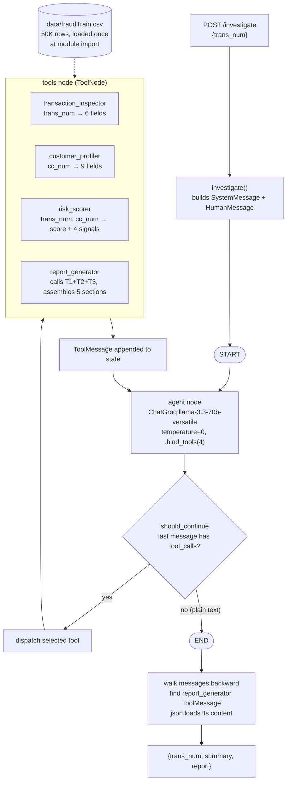

# Fraud Investigation Agent

A LangGraph agent that takes a flagged transaction ID, runs four rule-based investigation tools in a fixed sequence, and returns a structured risk verdict with a per-signal evidence trail.

**Repo:** [github.com/joy4t/fraud-investigation-agent](https://github.com/joy4t/fraud-investigation-agent)

**Live demo:** currently offline. The previous Railway deployment has been deprovisioned. Redeployment to HuggingFace Spaces is the first roadmap item.

---

## Problem

Fraud analysts at banks and fintechs work a queue. A model or a rules engine flags transactions, and a human opens them one at a time to decide: real fraud, or a customer doing something unusual but legitimate? That decision is mostly tacit knowledge. The analyst holds the customer's normal behaviour in their head, compares the flagged transaction against it across several dimensions at once, and forms a judgement. It is inconsistent between analysts, hard to audit after the fact, and it does not scale with queue volume.

The interesting part is not the classification. It is the investigation: gathering the evidence, weighing it, and producing something a second human can read and disagree with.

This project encodes that investigation as a scripted agent. It is a portfolio demonstration of the pattern, built and evaluated on a 50,000-row sample of a public Kaggle dataset. It is not a production fraud detection system, it has never seen a real transaction, and the Failure Modes section below is specific about where that distinction bites.

## Solution

A LangGraph agent exposed behind a FastAPI endpoint. You POST a transaction ID, and it returns a verdict, a five-section report, and a one-sentence summary.

Internally the LLM is given four tools and a system prompt that names the order to call them in:

1. `transaction_inspector` pulls the raw facts for the transaction.
2. `customer_profiler` builds that cardholder's behavioural baseline from their transaction history.
3. `risk_scorer` scores the transaction against that baseline on four signals and returns 0 to 100 plus a risk level.
4. `report_generator` calls the other three and assembles their output into a structured report.

The LLM then writes a one-sentence summary, which is how the graph knows to stop.

Worth being precise about what this is: it is one reasoning model plus four rule-based tools, executed as a scripted five-step chain through LangGraph's tool-calling loop. The tools contain no LLM calls and make no network requests, they are pandas and arithmetic. The LLM does not decide the investigation order, the system prompt does. What LangGraph buys here is explicit state, a real conditional edge, and an auditable message trace, rather than emergent tool selection.

## Impact

Portfolio project, so the honest framing is what it demonstrates rather than business outcomes it does not have.

- **A complete agent loop, built from parts rather than a template.** State schema with a reducer, tool node, conditional edge, termination condition, and the message-history walk that extracts structured output from a `ToolMessage`. All of it is small enough to read in one sitting and explain line by line.
- **Domain reasoning encoded as testable rules.** The four signals (amount deviation against the customer's own median, transaction hour against their typical window, merchant distance from home, spending category against their top three) are how a human analyst actually triages. Because they are rules rather than a learned model, every score decomposes into a readable explanation.
- **A JSON API rather than a demo UI.** The intended consumer is another service, so the agent is wrapped in FastAPI with typed request and response models.
- **Evaluation that found real defects.** Running the committed scorer over the dataset surfaced two structural bugs that code reading alone had not: one of the four signals is effectively dead on this data, and the top risk band cannot be reached. Both are documented below rather than quietly fixed and forgotten.

No accuracy, precision, recall, or latency numbers are claimed. None have been measured, and the eval below is explicit about what it does and does not establish.

## Architecture



**State.** One `TypedDict` with a single field: `messages: Annotated[list, add_messages]`. `add_messages` is LangGraph's append reducer, so every LLM reply and every tool result accumulates in one list. There is no scratchpad field, no iteration counter, and no completion flag. Everything the run produces lives in that message list, which is also the audit trail.

**Termination.** Implicit. `should_continue` inspects the last message: if it carries `tool_calls`, route to the tools node, otherwise route to `END`. The loop ends because the LLM eventually emits plain text instead of a tool call, which the system prompt engineers by making step 6 "write a one-sentence summary". Nothing in this repo caps iterations. If the model looped, LangGraph's own default recursion limit would be the backstop, not anything written here.

**Output extraction.** The structured report never lives in a dedicated state field. `investigate()` walks the finished message list in reverse, finds the `ToolMessage` named `report_generator`, and `json.loads` its content. This works because LangChain serialises tool return values with `json.dumps` where possible, which holds here only because every tool casts its values to plain `str`, `float`, and `int` before returning. Nothing enforces that contract.

| File | Role |
| --- | --- |
| `src/agent.py` | State schema, LLM binding, agent node, `should_continue`, graph wiring, system prompt, `investigate()` |
| `src/api.py` | FastAPI app, Pydantic request and response models, the single `POST /investigate` route |
| `src/tools/_data.py` | Loads `fraudTrain.csv` once at module import and normalises `cc_num` to string |
| `src/tools/transaction_inspector.py` | Transaction facts plus a local haversine helper |
| `src/tools/customer_profiler.py` | Cardholder baseline aggregation |
| `src/tools/risk_scorer.py` | Four scoring bands, weighted total, risk level |
| `src/tools/report_generator.py` | Calls the other three via `.invoke()`, assembles the report, maps risk level to a recommendation string |

## Key Decisions

**LangGraph rather than a hardcoded chain, even though the sequence is scripted.** A fixed `inspector → profiler → scorer → reporter` pipeline could be four function calls in a loop, and for v1 it would behave identically. What the graph adds is the shape a production agent needs: explicit state with a reducer, a conditional edge that reads the model's output to decide routing, and a message history that doubles as an audit trail. Adding a fifth tool means appending to a list and editing a prompt, not rewiring control flow. The cost of this choice is honest to name: the architecture currently supports more autonomy than the system prompt allows it to use.

**Rule-based tools instead of a learned fraud model.** With 274 labelled fraud cases in the sample, a supervised model would be fitting noise, and its output would be a probability with no narrative attached. Hand-coded bands give the opposite tradeoff: worse discrimination, but every score decomposes into four readable clauses an analyst can argue with. For a system whose entire point is producing a reviewable investigation, that is the right side of the tradeoff. The cost is that the specific band thresholds have no principled basis, which the eval below makes concrete.

**Temperature zero.** The same transaction should produce the same investigation every time. With tool-calling, temperature also affects which tool the model selects and with what arguments, so non-zero temperature would mean non-reproducible investigation traces, not just reworded summaries.

**A single-field state schema.** No scratchpad, no accumulator fields, just `messages`. This is LangGraph's default idiom and it keeps the entire run inspectable in one place. The tradeoff surfaces in `investigate()`, which has to reverse-scan the message list for the report rather than reading it from a named field, and that extraction silently depends on tool outputs staying JSON-serialisable.

**FastAPI rather than a UI.** The consumer this is designed for is a transaction pipeline calling per flagged transaction, not a person clicking. A JSON API with typed models is the right surface, and it makes the deployment target a container rather than a notebook host.

## Failure Modes

Ordered roughly by how much each would hurt if this were real.

**The service is currently offline.** The Railway deployment has been deprovisioned. The root path, `/docs`, and `/openapi.json` all return 404, so this is a removed service rather than a sleeping one. Redeployment to HuggingFace Spaces as a Docker Space is the first roadmap item, and nothing in the repo has been changed for that target yet.

**The `distance_from_home` signal is effectively dead on the committed dataset.** The scorer defines four distance bands (0 points under 50km, 10 under 200km, 20 under 500km, 25 above). I ran the committed scorer over all 274 fraud rows plus a 400-row legit sample and the maximum merchant distance anywhere in that set is 137.7 km. Not one transaction reaches the 200km band. In practice the signal is binary, 0 or 10, and the two upper bands have never fired. The bands were written for a geography the sampled data does not contain.

**The CRITICAL risk band is unreachable, so the block recommendation is dead code.** This follows arithmetically from the point above. The maximum attainable total on this data is 25 (amount) + 25 (time) + 10 (distance, capped in practice) + 15 (category) = 75, and `CRITICAL` requires a score above 75. Across 674 scored transactions the observed maximum is exactly 75. `report_generator` maps `CRITICAL` to "BLOCK card immediately and escalate to senior analyst", and on the shipped dataset that branch can never execute. Three of the four risk levels are live, the fourth is decorative.

**Error handling is inconsistent across the four tools and untested on invalid input.** `transaction_inspector` raises an uncaught `IndexError` on an unknown `trans_num` (`.iloc[0]` on an empty filter result). `customer_profiler` raises an uncaught `ValueError` on an unknown `cc_num` (`int()` applied to a NaN quantile from an empty group). Only `risk_scorer` returns a graceful `{"error": "..."}` dict. `report_generator` checks `if "error" in transaction:` after calling the inspector, but that check is unreachable in practice because the inspector raises before it can return anything. The bare `except Exception` in `api.py` then converts all of it into a 500 with a raw Python exception string in the body, so a malformed transaction ID produces a server error rather than a 4xx. Fix planned, not applied.

**The signal dictionaries have inconsistent shape, and one signal name is misspelled in the returned JSON.** Two of the four signals use the key `details`, the other two use `detail`. The time signal's name is emitted as `time_anamoly`, not `time_anomaly`, and that string is the literal value in the API response's `signal_breakdown`, not a comment. Any consumer filtering on signal name or reading `details` uniformly will silently miss matches. Fix planned, not applied.

**`risk_scorer` duplicates computation the other tools already do.** It re-derives haversine distance, median and standard deviation of amount, and hour percentiles directly from the dataframe instead of calling `transaction_inspector` and `customer_profiler`. The numbers agree today because there is only one code path computing them, but any future change to the base computations would have to be made in two places or they drift. This is the same pattern that previously caused a score mismatch inside `report_generator`, which was fixed by making it call the real tools. `risk_scorer` never got that treatment.

**`cc_num` precision is already lost in the committed CSV.** `data/fraudTrain.csv` literally contains values like `581293000000.0`, verifiable by reading the file without pandas involved. The `.astype(int).astype(str)` in `_data.py` only strips the trailing `.0`, it cannot restore digits that are not in the file. Whatever produced this 50K sample round-tripped the column through a float before writing it, and that script is not in this repo. A `dtype={"cc_num": str}` fix at read time would prevent future loss on a clean re-sample but cannot repair this file.

**Scale: 50,000 rows, 274 fraud cases, a 0.55% base rate.** Enough to demonstrate the reasoning pattern and to surface the two structural bugs above. Not enough to claim anything about detection performance, and the sample is drawn from a training split of a public synthetic dataset, not from real transactions.

**The four signal weights are hand-tuned.** The z-score cutoffs, hour distances, kilometre bands, and the flat 15 points for category mismatch were chosen by judgement, not fitted to the label. This is a deliberate scope decision (the project demonstrates rule-based investigation, not model fitting), but the consequence is that there is no principled justification for any specific number, and the dead distance bands are what that looks like when it goes wrong.

**No evaluation harness in the repo.** The table below is the only evaluation that exists. The numbers in it are real executed tool output, but they were produced by an ad hoc script in a scratch environment, not by anything committed here that someone could re-run with one command.

**No conversation memory across investigations.** Every POST is an independent graph run with a fresh message list. This is correct for a one-shot-per-transaction API, but it also means the system cannot reason about sequences, which is exactly the gap the adversarial eval case below exposes.

**No caching or lazy loading of the dataset.** `_data.py` reads and casts the full 50K-row CSV at module import, so every cold start pays that cost in full before the first request can be served.

**No `pattern_matcher` or any multi-transaction signal.** Velocity, repeated small charges, impossible travel between consecutive transactions: none of it exists. Scoped out of v1 deliberately, and the eval below shows precisely what that costs.

## Evaluation

> **What this eval verifies.** The four investigation tools are pure pandas with no LLM inside them — given a transaction ID, `risk_scorer` will return the same score whether called by the LangGraph agent, a Python REPL, or a unit test. I executed the committed tools directly against real rows from `data/fraudTrain.csv`, so every score, risk band, and signal breakdown below is real output from the code in this repo, verifiable by re-running the tools yourself. **What this eval does NOT verify:** the orchestration layer. Whether the LLM calls the tools in the right order, passes the right arguments, and produces a defensible summary requires the live service, which is currently offline pending the HF Spaces redeployment. Once that redeployment is live, the same 8 cases will be re-run through the full agent to verify end-to-end behavior. Aggregate figures cited below come from scoring all 274 fraud rows plus a 400-row legit sample drawn with `random_state=42`.

| # | Case | Expected verdict | Agent behaviour (executed tool output) | Verdict quality | Reasoning quality | Overall |
| --- | --- | --- | --- | --- | --- | --- |
| 1 | `005a3e70…` $924.87 shopping_pos at 22:11, 119km out | HIGH, fraud | **75, HIGH.** All four fire: amount 25 (z=7.1 vs median $44.99), time 25 (hour 22 vs typical 05-19), distance 10 (119km), category 15 (not in top 3) | **Pass**: correct band, and the highest score this scorer can produce on this data | **Pass**: four independent signals, each readable and individually defensible | **Pass** |
| 2 | `402a1127…` $964.17 shopping_net at 20:08, 50km out | HIGH, fraud | **75, HIGH.** amount 25 (z=5.8 vs $54.94), time 25 (hour 20 vs 04-16), distance 10 (50.0km), category 15 | **Pass**: correct band | **Pass**: amount and time carry the call, distance contributes marginally | **Pass** |
| 3 | `b7acd15e…` $1003.72 shopping_net at 22:28, 84.7km out | HIGH, fraud | **75, HIGH.** amount 25 (z=3.9 vs $55.36), time 25 (hour 22 vs 07-18), distance 10 (84.7km), category 15 | **Pass**: correct band | **Pass**: same signal profile as cases 1 and 2, which is the pattern this ruleset is built for | **Pass** |
| 4 | `74fd30a1…` $55.59 home at 15:58, 29.4km out | LOW, legit | **0, LOW.** Every signal zero: z=0.3, hour inside 07-18, 29.4km, category in top 3 | **Pass**: correctly cleared | **Pass**: silence across all four signals is the right evidence for "nothing to see" | **Pass** |
| 5 | `a54562cc…` $41.47 gas_transport at 08:45, 42.6km out | LOW, legit | **0, LOW.** z=0.1, hour inside 05-11, 42.6km, category in top 3 | **Pass**: correctly cleared | **Pass**: baseline match on all four dimensions | **Pass** |
| 6 | `8faa9fa3…` $179.18 grocery_pos at 03:42 on 25 Dec, 50.4km out | MEDIUM, legit but worth a human look | **35, MEDIUM.** time 25 (hour 3 vs typical 08-19), distance 10, amount 0 (z=1.0), category 0 (in top 3) | **Pass**: lands in the review band rather than being cleared or blocked | **Partial**: the trace is honest but thin. A 3am Christmas grocery run is explainable context the system has no way to represent, so it flags on time alone | **Pass** |
| 7 | `574d9897…` $36.64 kids_pets at 23:14, 109km out | MEDIUM, ambiguous | **50, MEDIUM.** time 25 (hour 23 vs 09-19), distance 10 (109km), category 15, amount 0 (z=0.2, $36.64 vs median $60.76) | **Pass**: correctly ambiguous, at the top of the MEDIUM band | **Partial**: three weak signals stack to 50 on a $36 purchase. Defensible as "unusual", but the score is driven by band arithmetic rather than by anything a human would call suspicious | **Pass** |
| 8 | `f0399fce…` $23.33 gas_transport at 11:14, 25.0km out. **Confirmed fraud.** | Should flag, realistically will not | **0, LOW.** Every signal reads zero: amount 0 (z=0.3 vs median $44.55), time 0 (hour 11 inside 08-17), distance 0 (25.0km), category 0 (gas_transport is the customer's top category) | **Fail**: confirmed fraud scored 0 out of 100 and would be cleared with "NO ACTION" | **Fail**: not a weighting problem. The transaction is genuinely indistinguishable from this customer's normal behaviour on all four axes the system can see | **Fail** |

**What this shows.** The ruleset does what it was built to do: when fraud is loud across several dimensions at once, cases 1 to 3 all hit the ceiling and the evidence trail reads cleanly, and genuinely normal transactions come back silent. Cases 6 and 7 behave correctly in the sense that ambiguity routes to human review, but both expose that the score is band arithmetic rather than judgement, and a 3am holiday grocery run gets flagged for a reason no analyst would write down.

Case 8 is the one that matters. It is confirmed fraud that scores zero, and it fails for a structural reason rather than a tuning one: a small, in-category, near-home purchase inside the customer's normal hours is invisible to a system that only ever looks at one transaction against an aggregate baseline. No reweighting of these four signals catches it. Across the full fraud set, 30 of 274 cases score LOW, so this is a class of miss rather than an unlucky example. Catching it requires signals this system does not have, which is the argument for the `pattern_matcher` roadmap item below: velocity, repeated small charges, and sequence-aware checks operate on patterns across transactions, which is the dimension where this kind of fraud is actually visible.

## Stack

| Layer | Choice |
| --- | --- |
| Language | Python 3.11 |
| Agent framework | LangGraph (`StateGraph`, `ToolNode`, conditional edges) |
| LLM integration | LangChain, `langchain-groq` |
| Model | Llama 3.3 70B Versatile via the Groq API, temperature 0 |
| Tools / data | pandas over a committed 50K-row CSV |
| API | FastAPI, Pydantic models, Uvicorn |
| Planned host | HuggingFace Spaces (Docker Space, uvicorn on port 7860) |

**Running locally**

```bash
conda create -n fraud-agent python=3.11
conda activate fraud-agent
pip install -r requirements.txt
echo "GROQ_API_KEY=your_key_here" > .env
python -m src.api
```

Then open `http://localhost:8000/docs` for the Swagger UI. `GROQ_API_KEY` is the only secret required.

## Roadmap

1. **Redeploy on HuggingFace Spaces** as a Docker Space running uvicorn on port 7860, preserving the JSON API rather than wrapping it in a UI. `GROQ_API_KEY` goes in repository secrets.
2. **Harden error handling** across all four tools with the `{"error": "..."}` pattern the scorer already uses, and give the API layer real 4xx responses for bad input instead of collapsing everything into a 500.
3. **Normalise the signal dictionaries** to one shape and fix the `time_anamoly` spelling in the emitted JSON.
4. **Consolidate `risk_scorer`** so it calls `transaction_inspector` and `customer_profiler` for its evidence instead of recomputing, removing the drift risk.
5. **Add a `pattern_matcher` tool** for multi-transaction signals: velocity, repeated small charges, impossible travel between consecutive transactions. This is the item that targets the case 8 class of miss.
6. **Replace the hand-tuned weights** with a lightweight learned baseline over the labelled data, and re-scale the distance bands to the range the data actually contains so the signal stops being binary.
7. **Re-sample the dataset from a clean source** with `dtype={"cc_num": str}` at read time to resolve the `cc_num` precision issue.
8. **Add caching or lazy loading** for the dataframe so cold starts do not pay the full CSV load.
